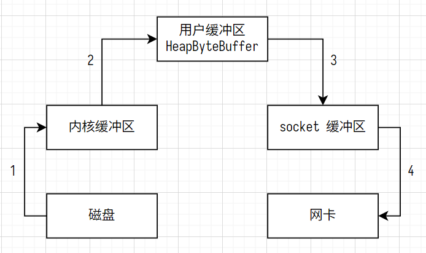
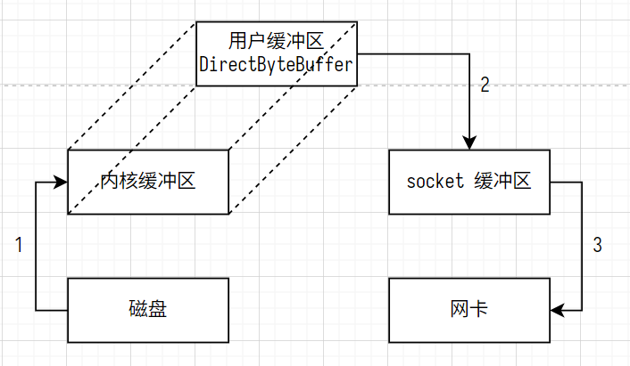
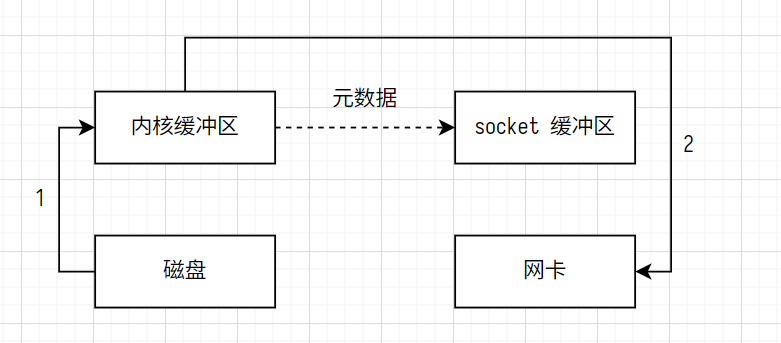
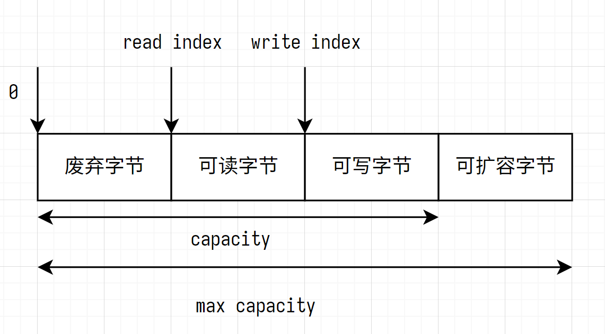

# java-socket

## Non-blocking IO 非阻塞 IO

### channel 数据读写的双向通道

- stream 数据读写的单向通道
- channel 数据读写的双向通道
- channel 是更底层的数据结构

常见的 channel

- java.nio.channels.FileChannel
- java.nio.channels.DatagramChannel
- java.nio.channels.SocketChannel
- java.nio.channels.ServerSocketChannel

### buffer 数据缓冲区

常见的 buffer

- java.nio.ByteBuffer
  - java.nio.MappedByteBuffer
  - java.nio.DirectByteBuffer (堆外内存)
  - java.nio.HeapByteBuffer (jvm 堆内存)
- java.nio.ShortBuffer
- java.nio.IntBuffer
- java.nio.LongBuffer
- java.nio.FloatBuffer
- java.nio.DoubleBuffer
- java.nio.CharBuffer

Selector 服务器: 一个线程处理一个 socket 连接

## ByteBuffer

```java
public abstract sealed class ByteBuffer // 密封类
    extends Buffer
    implements Comparable<ByteBuffer>
    permits
    HeapByteBuffer, MappedByteBuffer
```

ByteBuffer 属性

- capacity 容量 (ByteBuffer 不能动态扩容)
- position 读/写指针
- limit 读/写限制 (position <= limit)

### 使用

- 读 buf 前调用 flip 方法: 写模式 -> 读模式
  - position 写指针 -> 读指针
  - limit 写限制 -> 读限制
- 写 buf 前调用 clear 方法: 清空脏数据
- 写 buf 前调用 compact 方法: 紧凑数据, 不清空数据

### ByteBuffer 常见方法

```java
// 分配 jvm 堆内存, 不能动态扩容
public static ByteBuffer allocate(int capacity);

// 分配堆外内存, 不能动态扩容
public static ByteBuffer allocateDirect(int capacity);
```

向 buffer 写入数据

- 调用 channel 的 read 方法: 从 channel 中读, 向 buffer 中写
- 调用 buffer 的 put 方法

```java
// 调用 channel 的 read 方法, 从 channel 中读, 向 buffer 中写
int nBytes = channel.read(buf);
// 调用 buffer 的 put 方法
buf.put((byte) 1 << 7 - 1)
```

从 buffer 读出数据

- 调用 channel 的 write 方法: 从 buffer 中读, 向 channel 中写
- 调用 buffer 的 get 方法: get 方法不会删除 buffer 中的数据

其他方法

- get(3): 读出 buffer 中索引为 3 的元素
- rewind() 重置 position 读写指针为 0
- mark(3) 标记索引为 3 的元素
- reset() 重置 position 读写指针为 3

> Buffer 是线程不安全的

## 文件编程

### FileChannel

> FileChannel 只能工作在阻塞模式下

调用 FileInputStream, FileOutputStream, 或 RandomAccessFile 以获取 FileChannel

- 通过 FileInputStream 获取的 channel 只读
- 通过 FileOutputStream 获取的 channel 只写
- RandomAccessFile 可以指定读写模式

```java
// 读文件
int nBytes = channel.read(buf);
// 写文件
int nBytes = channel.write(buf);
// 获取当前读写的文件流的位置
long pos = channel.position();
// 设置当前读写的文件流的位置
channel.position(new Random().nextLong(channel.size())/* newPos */);
// 获取文件流的大小
long size = channel.size();
```

## Path 和 Paths

- Path 文件路径
- Paths 工具类, 用于获取 Path 实例

```java
// src/main/go
// src/main/java
// /home/user/data.txt
// /homee/user/to.txt
Path path = Paths.get("README.md"); // 使用相对 pom.xml 的相对路径
Path path = Paths.get("/home/user/data.txt"); // 使用绝对路径
Path path = Paths.get("/home/user"/* 目录 */, "data.txt"/* 文件 */);
```

```java
Path path = Paths.get("/home/user/../user/data.txt");
// 正常化路径
System.out.println(path.normalize()); // /home/user/data.txt

// 文件是否存在
System.out.println(Files.exists("src/main"));

Path newDir = Paths.get("src/main/go");
// 创建目录
Files.createDirectory(newDir);

Path src = Paths.get("/home/user/data.txt");
Path dst = Paths.get("/home/user/to.txt");
// 拷贝文件
// 如果文件已存在, 则抛出 FileAlreadyExistsException 异常
Files.copy(src, dst);

// 移动文件
// StandardCopyOption.ATOMIC_MOVE 保证文件移动的原子性
Files.move(src, dst, StandardCopyOption.ATOMIC_MOVE);

Path target = Paths.get("/home/user/to.txt");
// 删除文件
// 如果文件不存在, 则抛出 NoSuchFileException 异常
Files.delete(target);

Path target = Paths.get("src/main/go");
// 删除目录
// 如果目录非空, 则抛出 DirectoryNotEmptyException 异常
Files.delete(target);
```

## 网络编程

```java
// 将调用者线程的中断标志设置为 true
Thread.currentThread().interrupt();
// 获取当前线程的中断标志 (是否为 true)
Thread.currentThread().isInterrupted();
// 获取当前线程的中断标志, 并重置为 false
Thread.interrupted();
```

**阻塞 IO 与非阻塞 IO**

- ServerSocketChannel::accept
  没有新的连接时, 线程阻塞, 放弃 cpu
- SocketChannel::read
  没有新的数据时, 线程阻塞, 放弃 cpu
- 对于 64 位 jvm, 1 个线程 1 MB, 线程过多会导致 OOM

**处理消息的边界**

- TCP 可靠, 面向字节流, TCP 消息没有边界
  - 按行分隔符 \n 拆分 TCP 数据包
- UDP 不可靠, 面向用户数据报, UDP 消息有边界

事件触发后, 要么处理, 要么取消 cancel. 否则该事件将持续触发: NIO 基于 epoll 的水平触发 Level Trigger

## NIO 和 BIO

### stream 和 channel

- stream 不使用操作系统缓冲区；channel 使用操作系统的发送缓冲区; 接收缓冲区, 更底层
- stream 只支持阻塞 IO；channel 支持阻塞; 非阻塞 IO, 可配合 selector 实现 IO 多路复用
- stream 和 channel 都是全双工, 即可以同时读写

### IO 模型

1. 内核态; 等待数据: 数据 -> 网卡
2. 内核态; 复制数据: 网卡 -> 操作系统接收缓冲区
3. 用户态; 复制数据: 操作系统接收缓冲区 -> 用户缓冲区

- 同步: 线程自己获取 IO 结果 (单线程)
- 异步: 线程自己不获取 IO 结果, 有其他线程通知 IO 结果 (多线程)

1. 同步阻塞 IO: 线程阻塞, 放弃 cpu, 一个线程处理一个连接
2. 同步非阻塞 IO: 线程轮询 (忙等) , 一个线程只能处理一个连接
3. 同步 IO 多路复用: 基于 Selector, 一个线程可以处理多个连接
4. 异步非阻塞 IO: 有其他线程通知 IO 结果

### 零拷贝

```java
var file = new File("./data.txt");
var fileStream = new RandomAccessFile(file, "r");
var buf = new byte[(int) file.length()];

// 调用 read 方法
// 用户态 -> 内核态
// 操作系统使用 DMA, 将数据从磁盘拷贝到内核缓冲区, 不占用 cpu
// 内核态 -> 用户态
// 用户线程将数据从内核缓冲区拷贝到用户缓冲区 (即 byte[] buf) , 占用 cpu
fileStream.read(buf);

Socket socket = new Socket("127.0.0.1", 8080);

// 调用 write 方法
// 用户线程将数据从用户缓冲区 (即 byte[] buf) 拷贝到操作系统 socket 缓冲区, 占用 cpu
// 用户态 -> 内核态
// 操作系统使用DMA, 将数据从 socket 缓冲区拷贝到网卡, 不占用 cpu
socket.getOutputStream().write(buf);
```

- 数据拷贝: 4 次
- 用户态与内核态的切换: 3 次



> 优化: 使用 DirectByteBuffer

```java
HeapByteBuffer ByteBuffer.allocate(int capacity); // 使用 jvm 堆内存
DirectByteBuffer ByteBuffer.allocate(int capacity); // 使用操作系统内存
```

- 数据拷贝: 3 次
- 用户态与内核态的切换: 3 次



> 优化: 使用 transferTo 和 transferFrom

transferTo, transferFrom 基于 <sys/sendfile.h> 中的 sendfile 函数

```c
#include <assert.h>
#include <fcntl.h>
#include <stdio.h>
#include <sys/sendfile.h>
#include <unistd.h>

int main() {
  // 只读
  int inputFd = open("../README.md", O_RDONLY);
  assert(inputFd != -1);
  // 只写; 必要时创建; 重写
  int outputFd = open("../README.txt", O_WRONLY | O_CREAT | O_TRUNC, 0644);
  assert(outputFd != -1);
  off_t offset = 0;  // offset 将被拷贝到 socket 缓冲区
  ssize_t nSentBytes = sendfile(outputFd, inputFd, &offset, 1024);
  assert(nSentBytes != -1);
  close(inputFd);
  close(outputFd);
  return 0;
}
```

```java
var fileStream = new FileOutputStream("data.txt");
var fileChannel = fileStream.getChannel();
SocketChannel socket = SocketChannel.open();
socket.connect(new InetSocketAddress("127.0.0.1", 8080));
long position = 0;
long left = fileChannel.size();

// 调用 transferTo 方法
// 用户态 -> 核心态
// 操作系统使用 DMA, 将数据从磁盘拷贝到内核缓冲区, 不占用 cpu
// 操作系统将 offset, length 等元数据拷贝到 socket 缓冲区, cpu 占用可忽略
// 操作系统使用 DMA, 将数据从内核缓冲区拷贝到网卡, 不占用 cpu
long nBytes = fileChannel.transferTo(position, left, fileChannel);
```

- 数据拷贝: 2 次
- 用户态与内核态的切换: 1 次



零拷贝: 从操作系统内存到 jvm 内存 (用户缓冲区) 的拷贝次数为 0

- 更少的数据拷贝
- 更少的用户态与内核态的切换
- 更少的 cpu 占用
- 适用于频繁的小文件传输

## Netty

Netty 是一个异步的; 事件驱动的网络应用程序框架, 用于快速开发可维护的; 高性能的网络协议服务器和客户端

Netty is an asynchronous event-driven network application framework
for rapid development of maintainable high performance protocol servers & clients.

1. EventLoop
2. Channel
3. Future, Promise
4. Handler, Pipeline
5. ByteBuf

### Future, Promise

- jdk Future 只能同步等待任务执行结束, 获取返回值.
- netty Future
  - 可以同步等待任务执行结束, 获取返回值.
  - 可以异步执行任务, 直接获取返回值. 任务执行未结束, 则返回值为空; 任务已结束, 则返回值为非空.

### Handler, Pipeline

责任链设计模式

- ChannelHandler 处理 Channel 上的入站; 出站事件
- ChannelPipeline 是 ChannelHandlerContext (封装了 ChannelHandler) 的双向链表
- head <-> in1 <-> in2 <-> in3 <-> out4 <-> out5 <-> tail

### ByteBuf

```java
// 池化的直接内存 -- 分配和回收的代价高, 读写性能高, 不能被 gc
var buf1/* PooledUnsafeDirectByteBuf */ = ByteBufAllocator.DEFAULT.buffer(16);
var buf2/* PooledUnsafeDirectByteBuf */ = ByteBufAllocator.DEFAULT.directBuffer(16);
// 池化的 jvm 内存 -- 分配和回收的代价低, 读写性能低, 可以被 gc
var buf3/* PooledUnsafeHeapByteBuf */ = ByteBufAllocator.DEFAULT.heapBuffer(16);
```

- 池化: 可重用 ByteBuf
- 开启池化功能 (默认开启)
- Netty 使用引用计数回收内存

```shell
-Dio.netty.allocator.type={unpooled|pooled}
```



///////////////////////////////////
///
/// TODO TailContext 丢弃未处理消息
///
///////////////////////////////////

```java
// io.netty.channel.DefaultChannelPipeline#onUnhandledInboundMessage(java.lang.Object)
protected void onUnhandledInboundMessage(Object msg) {
  try {
    logger.debug("Discarded inbound message {} that reached at the tail of the pipeline. Please check your pipeline configuration.", msg);
  } finally {
    ReferenceCountUtil.release(msg);
  }
}

// io.netty.util.ReferenceCountUtil#release(java.lang.Object)
public static boolean release(Object msg) {
  if (msg instanceof ReferenceCounted) {
    return ((ReferenceCounted) msg).release();
  }
  return false;
}
```
